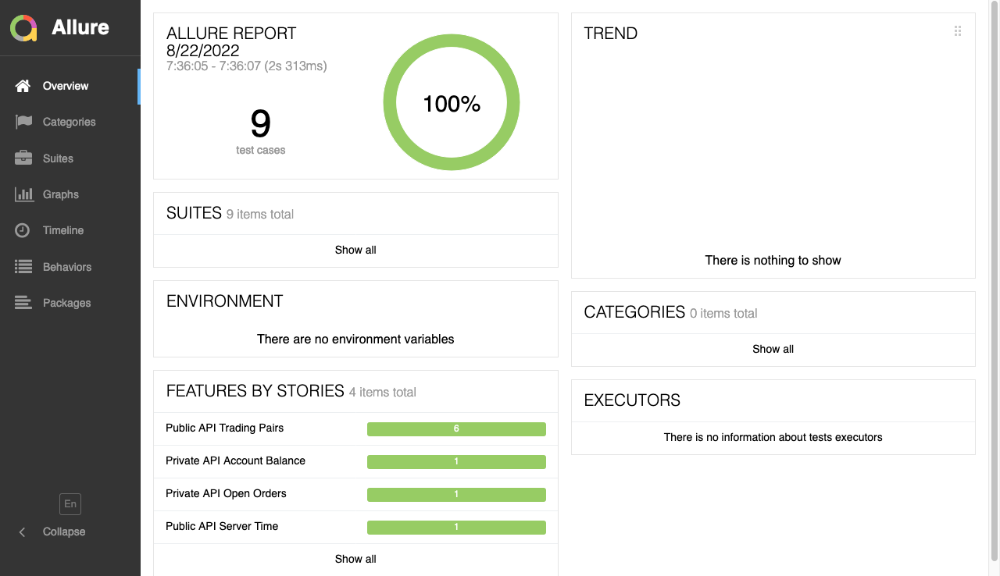

# otto behave

## Running the tests locally

Setup and activate the virtual environment

```
python -m venv .venv
source .venv/bin/activate
pip install -r requirements.txt
```

⚠️ Set the api url, key, secret (must be first set up on the dashboard) and password (api otp must be enabled) in the environment variables and export them.

```
export OTTO_URL=<OTTO_URL>
export OTTO_KEY=<OTTO_KEY>
export OTTO_SECRET=<OTTO_SECRET>
export OTTO_OTP=<OTTO_OTP>
```

Running the `behave` using one of the commands below:

```
# to run all of the tests
❯ behave
...
4 features passed, 0 failed, 0 skipped
9 scenarios passed, 0 failed, 0 skipped
59 steps passed, 0 failed, 0 skipped, 0 undefined
Took 0m2.110s


# to run by tags, e.g. public api tests only
❯ behave --tags="@public_api"
...
2 features passed, 0 failed, 2 skipped
7 scenarios passed, 0 failed, 2 skipped
47 steps passed, 0 failed, 12 skipped, 0 undefined
Took 0m1.708s


# to run a single feature file
❯ behave features/balance.feature
...
1 feature passed, 0 failed, 0 skipped
1 scenario passed, 0 failed, 0 skipped
6 steps passed, 0 failed, 0 skipped, 0 undefined
Took 0m0.227s
```

Producing the test reports. We'll be using allure to generate and view test reports.
First [allure-framework](https://github.com/allure-framework/allure2#download) must be installed as a standalone.

Once it's installed we run the `behave` with the specific formatter for the report output.

```
behave -f allure_behave.formatter:AllureFormatter -o reports
```

And then use the `allure serve reports` to generate a report and make a local server instance to view them.




## Running tests using Docker

⚠️ We must first set the environment variables in the `Dockerfile` for the api calls and authentication.

Then build the image using Dockerfile and run tests in a container

```
docker build --tag otto-behave .
...
docker run -it otto-behave
```

Or leverage [allure-docker-service](https://github.com/fescobar/allure-docker-service) to produce reports.

```
docker compose up
```

Once it's done, reports will be available on

```
http://localhost:5050/allure-docker-service/projects/default/reports/latest/index.html?redirect=false
```
